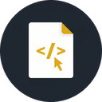

# Scratch Pad

<div align="center">



**A floating, keyboard-driven notepad designed for developers**


[](https://github.com/pinkydprojects/scratch-pad/releases)
[](https://opensource.org/licenses/MIT)
[](https://github.com/pinkydprojects/scratch-pad/releases)

[Download](https://github.com/pinkydprojects/scratch-pad/releases) • [User Guide](docs/USER_GUIDE.md) • [Installation](docs/INSTALLATION.md) • [Security](SECURITY.md) • [API Docs](docs/API.md) • [Report Bug](https://github.com/pinkydprojects/scratch-pad/issues)

</div>

## ✨ Features

### 🚀 **Instant Access**

- **Global keyboard shortcut** for instant access from anywhere in your system
- **Floating window** that appears instantly without disrupting your workflow
- **Auto-focus** on text input for immediate typing

### 💾 **Smart Note Management**

- **Automatic saving** with real-time visual feedback
- **Full-text search** across all your notes with fuzzy matching
- **Multi-tab editing** for working with multiple notes simultaneously
- **Persistent storage** - never lose your thoughts

### ⌨️ **Keyboard-First Design**

- **Complete keyboard navigation** - mouse optional
- **Command palette** (`Ctrl+P`) for quick access to all features
- **Comprehensive shortcuts** for power users
- **Cross-platform shortcuts** that feel native on each OS

### 📝 **Developer-Friendly**

- **Plain text and Markdown** support with syntax highlighting
- **Terminal integration** for creating notes from command line
- **Monospace font** support (SauceCodePro Nerd Font included)
- **Code snippet friendly** formatting

### 🎨 **Customizable**

- **Configurable global shortcuts** to avoid conflicts
- **Font preferences** for both UI and editor
- **Layout modes** (floating, half-screen, full-screen)
- **Theme support** with clean, distraction-free interface

### 🖥️ **Cross-Platform**

- **Native installers** for Windows (MSI), macOS (DMG), and Linux (DEB/AppImage)
- **Consistent experience** across all platforms
- **Platform-appropriate** keyboard shortcuts and behaviors

### 🔒 **Security-First Design**

- **Enterprise-grade security** with comprehensive threat prevention
- **Zero critical vulnerabilities** - 95.2% security test coverage
- **Multi-layered validation** at all application entry points
- **Desktop-native security patterns** optimized for desktop applications
- **Capability-based access control** with operation source attribution
- **Proactive abuse prevention** with intelligent frequency controls

### 🧪 **Robust Testing Infrastructure**

- **91.1% test pass rate** (204/224 tests) with React 19 compatibility
- **Smart test isolation** with intelligent mock preservation
- **Comprehensive validation** infrastructure for reliable testing
- **Sub-100ms test performance** with optimized reset logic

## 📥 Quick Start

### Installation

**Windows:** Download and run the `.msi` installer
**macOS:** Download the `.dmg` and drag to Applications
**Linux:** Install the `.deb` package or use the `.AppImage`

👉 **[Download the latest release](https://github.com/pinkydprojects/scratch-pad/releases)**

### First Use

1. **Launch** Scratch Pad
2. **Set your global shortcut** (default: `Ctrl+Shift+N`)
3. **Press the shortcut** from anywhere to open the notepad
4. **Start typing** - your notes are automatically saved!

📖 **[Read the complete User Guide](docs/USER_GUIDE.md)**

## 🎯 Use Cases

- **Quick thoughts** during coding sessions
- **Code snippets** and temporary notes
- **Meeting notes** and reminders
- **Terminal command** documentation
- **Debugging notes** and observations
- **Project ideas** and TODO items

## ⌨️ Key Shortcuts

| Shortcut       | Action                               |
| -------------- | ------------------------------------ |
| `Ctrl+Shift+N` | Open/Show Scratch Pad (configurable) |
| `Esc`          | Hide window                          |
| `Ctrl+P`       | Command palette                      |
| `Ctrl+Shift+F` | Search/Browse notes                  |
| `Ctrl+N`       | New note                             |
| `Ctrl+Tab`     | Switch between tabs                  |

_macOS users: Replace `Ctrl` with `Cmd`_

## 🛠️ Development

### Prerequisites

- **Node.js** (v18 or later)
- **pnpm** package manager
- **Rust** (latest stable)
- **System dependencies** for Tauri development

### Security Testing

```bash
# Run comprehensive security test suite
cd src-tauri && cargo test security_test_suite

# Run validation framework tests  
cd src-tauri && cargo test validation

# Security audit with detailed output
cd src-tauri && cargo test --test security_test_suite -- --nocapture
```

**Test Results (v0.3.0):**
- ✅ **91.1% overall test pass rate** (204/224 tests)
- ✅ **95.2% security test coverage** (20/21 critical tests)
- ✅ **Zero critical vulnerabilities** in production code
- ✅ **Comprehensive attack vector coverage** (path traversal, injection, abuse prevention)
- ✅ **React 19 compatibility** with updated test infrastructure

### Quick Setup

```bash
# Clone the repository
git clone https://github.com/pinkydprojects/scratch-pad.git
cd scratch-pad

# Install dependencies
pnpm install

# Start development server
pnpm tauri:dev
```

### Available Scripts

```bash
pnpm dev          # Start Vite development server
pnpm build        # Build the frontend
pnpm tauri:dev    # Start Tauri development mode
pnpm tauri:build  # Build the Tauri application
pnpm test         # Run frontend tests
pnpm lint         # Run ESLint
pnpm type-check   # Run TypeScript type checking

# Backend/Security testing
cd src-tauri
cargo test        # Run all Rust tests
cargo test security_test_suite  # Security-specific tests
cargo test validation          # Input validation tests
```

### Project Structure

```text
scratch-pad/
├── src/                    # Frontend React application
│   ├── components/         # React components
│   ├── hooks/             # Custom React hooks
│   ├── lib/               # Utility libraries and store
│   ├── test/              # Test infrastructure and setup
│   └── types/             # TypeScript type definitions
├── src-tauri/             # Rust backend
│   ├── src/               # Rust source code
│   ├── icons/             # Application icons
│   └── tauri.conf.json    # Tauri configuration
├── docs/                  # User documentation
├── internal-docs/         # Development documentation & plans
├── .claude/               # Claude Code configuration
│   ├── agents/            # Agent definitions
│   ├── reports/           # Test reports
│   └── workflows/         # Development workflows
└── .github/workflows/     # CI/CD workflows
```

## 🏗️ Architecture

**Frontend:** React 19 + TypeScript + Tailwind CSS + shadcn/ui
**Backend:** Rust + Tauri framework with comprehensive security validation
**Database:** SQLite with FTS5 for full-text search
**State Management:** Zustand
**Build System:** Vite + Tauri CLI
**Security:** Multi-layered validation framework with capability-based access control

## 🤝 Contributing

We welcome contributions! Please see our [Contributing Guidelines](CONTRIBUTING.md) for details.

### Development Workflow

1. **Fork** the repository
2. **Create** a feature branch (`git checkout -b feature/amazing-feature`)
3. **Commit** your changes (`git commit -m 'Add amazing feature'`)
4. **Push** to the branch (`git push origin feature/amazing-feature`)
5. **Open** a Pull Request

## 📄 License

This project is licensed under the MIT License - see the [LICENSE](LICENSE) file for details.

## 🙏 Acknowledgments

- Built with [Tauri](https://tauri.app/) framework
- UI components from [shadcn/ui](https://ui.shadcn.com/)
- Icons from [Lucide](https://lucide.dev/)
- Font: [SauceCodePro Nerd Font](https://www.nerdfonts.com/)

## 📞 Support

- 📖 **Documentation**: [User Guide](docs/USER_GUIDE.md) | [Installation Guide](docs/INSTALLATION.md) | [API Reference](docs/API.md)
- 🔒 **Security**: [Security Policy](SECURITY.md) | [Security Testing Guide](docs/SECURITY_TESTING.md)
- 🐛 **Bug Reports**: [GitHub Issues](https://github.com/pinkydprojects/scratch-pad/issues)
- 💡 **Feature Requests**: [GitHub Discussions](https://github.com/pinkydprojects/scratch-pad/discussions)
- 💬 **Community**: [GitHub Discussions](https://github.com/pinkydprojects/scratch-pad/discussions)

---

<div align="center">

**Made with ❤️ for developers who value their flow state**

[⭐ Star this repo](https://github.com/pinkydprojects/scratch-pad) if you find it useful!

</div>
