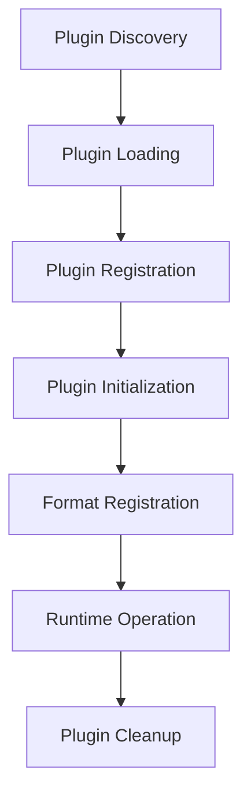

# Scratch Pad Plugin API Documentation

## Overview

The Scratch Pad Plugin API provides a comprehensive interface for extending the application with custom functionality. This document covers the complete API specification, development guidelines, and examples for creating plugins.

## Table of Contents

1. [Plugin Architecture](#plugin-architecture)
2. [Core API Reference](#core-api-reference)
3. [Plugin Development Guide](#plugin-development-guide)
4. [Example Implementations](#example-implementations)
5. [Testing Guidelines](#testing-guidelines)
6. [Deployment and Distribution](#deployment-and-distribution)
7. [Troubleshooting](#troubleshooting)
8. [Future API Extensions](#future-api-extensions)

## Plugin Architecture

### System Overview

The plugin system is built on a trait-based architecture that provides:

- **Type Safety**: All plugins implement the `Plugin` trait with compile-time guarantees
- **Thread Safety**: Plugins are `Send + Sync` for concurrent access
- **Error Handling**: Integrated error handling with the application's `AppError` system
- **Lifecycle Management**: Controlled initialization and cleanup
- **Format Registration**: Support for custom note formats

### Plugin Lifecycle



1. **Discovery**: Plugin manager scans for available plugins
2. **Loading**: Plugin code is loaded into memory
3. **Registration**: Plugin is registered with the plugin manager
4. **Initialization**: Plugin's `initialize()` method is called
5. **Format Registration**: Custom note formats are registered if provided
6. **Runtime Operation**: Plugin is available for use
7. **Cleanup**: Plugin resources are cleaned up on shutdown

## Core API Reference

### Plugin Trait

The `Plugin` trait is the core interface that all plugins must implement:

```rust
pub trait Plugin: Send + Sync {
    /// Returns the unique name of the plugin
    /// This name is used for identification and should be unique
    fn name(&self) -> &str;
    
    /// Returns the plugin version using semantic versioning
    /// Format: MAJOR.MINOR.PATCH (e.g., "1.0.0")
    fn version(&self) -> &str;
    
    /// Initialize the plugin when it's loaded
    /// This method is called once during plugin registration
    /// Use this for setup, configuration loading, resource allocation
    fn initialize(&mut self) -> Result<(), AppError>;
    
    /// Register a custom note format if the plugin provides one
    /// Return None if the plugin doesn't provide a note format
    /// Return Some(NoteFormat) to register a new format
    fn register_note_format(&self) -> Option<NoteFormat>;
    
    /// Optional: Provide a description of the plugin's functionality
    /// This is displayed in plugin management interfaces
    fn description(&self) -> Option<&str> {
        None
    }
    
    /// Optional: Provide plugin author information
    /// Used for attribution and contact information
    fn author(&self) -> Option<&str> {
        None
    }
}
```

### Error Handling

All plugin operations use the application's unified error handling system:

```rust
#[derive(Debug, thiserror::Error)]
pub enum AppError {
    #[error("Plugin error: {message}")]
    Plugin { message: String },
    
    #[error("Database error: {0}")]
    Database(#[from] rusqlite::Error),
    
    #[error("IO error: {0}")]
    Io(#[from] std::io::Error),
    
    #[error("Serialization error: {0}")]
    Serialization(#[from] serde_json::Error),
    
    // ... other error types
}
```

### Note Format System

Plugins can register custom note formats:

```rust
#[derive(Debug, Clone, Serialize, Deserialize)]
pub enum NoteFormat {
    #[serde(rename = "plaintext")]
    PlainText,
    
    #[serde(rename = "markdown")]
    Markdown,
    
    // Future: Custom formats will be supported
    // #[serde(rename = "custom")]
    // Custom(String),
}
```

### Plugin Manager API

The `PluginManager` provides the following functionality:

```rust
impl PluginManager {
    /// Create a new plugin manager instance
    pub fn new() -> Self;
    
    /// Load plugins from the specified directory
    /// Creates the directory if it doesn't exist
    pub fn load_plugins(&mut self, plugin_dir: &Path) -> Result<(), AppError>;
    
    /// Register a plugin with the manager
    /// Calls initialize() and registers note formats
    pub fn register_plugin(&mut self, plugin: Box<dyn Plugin>) -> Result<(), AppError>;
    
    /// Get all available note formats from registered plugins
    pub fn get_note_formats(&self) -> Vec<NoteFormat>;
    
    /// Get information about all loaded plugins
    pub fn get_plugins(&self) -> &[Box<dyn Plugin>];
    
    /// Get the number of loaded plugins
    pub fn plugin_count(&self) -> usize;
}
```

## Plugin Development Guide

### Setting Up Development Environment

1. **Prerequisites**:
   - Rust toolchain (latest stable)
   - Access to scratch-pad source code
   - Understanding of the `Plugin` trait

2. **Project Structure**:
   ```
   plugins/
   ├── my_plugin/
   │   ├── src/
   │   │   └── lib.rs
   │   ├── Cargo.toml
   │   └── README.md
   └── examples/
       └── my_plugin_example.rs
   ```

### Basic Plugin Implementation

Here's a minimal plugin implementation:

```rust
use scratch_pad_lib::error::AppError;
use scratch_pad_lib::models::NoteFormat;
use scratch_pad_lib::plugin::Plugin;

pub struct MyPlugin {
    name: String,
    version: String,
    initialized: bool,
    // Add your plugin-specific fields here
}

impl MyPlugin {
    pub fn new() -> Self {
        Self {
            name: "My Plugin".to_string(),
            version: "1.0.0".to_string(),
            initialized: false,
        }
    }
}

impl Plugin for MyPlugin {
    fn name(&self) -> &str {
        &self.name
    }
    
    fn version(&self) -> &str {
        &self.version
    }
    
    fn initialize(&mut self) -> Result<(), AppError> {
        if self.initialized {
            return Ok(());
        }
        
        // Perform initialization logic here:
        // - Load configuration files
        // - Initialize external resources
        // - Set up internal state
        // - Validate dependencies
        
        println!("🔌 Initializing {} v{}", self.name, self.version);
        
        self.initialized = true;
        println!("✅ {} initialized successfully", self.name);
        
        Ok(())
    }
    
    fn register_note_format(&self) -> Option<NoteFormat> {
        // Return None if no custom format
        // Return Some(NoteFormat::PlainText) or Some(NoteFormat::Markdown)
        // for existing formats, or Some(NoteFormat::Custom("format_name"))
        // for future custom formats
        None
    }
    
    fn description(&self) -> Option<&str> {
        Some("A description of what your plugin does")
    }
    
    fn author(&self) -> Option<&str> {
        Some("Your Name <your.email@example.com>")
    }
}

impl Default for MyPlugin {
    fn default() -> Self {
        Self::new()
    }
}
```

### Advanced Plugin Patterns

#### Configuration Management

```rust
use serde::{Deserialize, Serialize};
use std::fs;
use std::path::Path;

#[derive(Debug, Serialize, Deserialize)]
struct PluginConfig {
    enabled: bool,
    custom_setting: String,
    numeric_setting: i32,
}

impl Default for PluginConfig {
    fn default() -> Self {
        Self {
            enabled: true,
            custom_setting: "default_value".to_string(),
            numeric_setting: 42,
        }
    }
}

impl MyPlugin {
    fn load_config(&self, config_path: &Path) -> Result<PluginConfig, AppError> {
        if config_path.exists() {
            let config_str = fs::read_to_string(config_path)?;
            let config: PluginConfig = serde_json::from_str(&config_str)?;
            Ok(config)
        } else {
            // Create default config
            let config = PluginConfig::default();
            let config_str = serde_json::to_string_pretty(&config)?;
            fs::write(config_path, config_str)?;
            Ok(config)
        }
    }
}
```

#### Resource Management

```rust
use std::sync::Arc;
use std::sync::Mutex;

pub struct ResourceManager {
    resources: Arc<Mutex<Vec<String>>>,
}

impl ResourceManager {
    pub fn new() -> Self {
        Self {
            resources: Arc::new(Mutex::new(Vec::new())),
        }
    }
    
    pub fn allocate_resource(&self, resource: String) -> Result<(), AppError> {
        let mut resources = self.resources.lock().map_err(|e| AppError::Plugin {
            message: format!("Failed to lock resources: {}", e),
        })?;
        
        resources.push(resource);
        Ok(())
    }
    
    pub fn cleanup(&self) -> Result<(), AppError> {
        let mut resources = self.resources.lock().map_err(|e| AppError::Plugin {
            message: format!("Failed to lock resources for cleanup: {}", e),
        })?;
        
        // Clean up all allocated resources
        for resource in resources.drain(..) {
            println!("Cleaning up resource: {}", resource);
            // Perform actual cleanup
        }
        
        Ok(())
    }
}
```

### Plugin Registration

Currently, plugins are registered as built-in plugins. Add your plugin to the `register_builtin_plugins()` method:

```rust
// In src-tauri/src/plugin.rs
fn register_builtin_plugins(&mut self) -> Result<(), AppError> {
    // Register existing plugins
    let hello_plugin = Box::new(HelloWorldPlugin::new());
    self.register_plugin(hello_plugin)?;
    
    // Register your plugin
    let my_plugin = Box::new(MyPlugin::new());
    self.register_plugin(my_plugin)?;
    
    Ok(())
}
```

## Example Implementations

### Example 1: Simple Processing Plugin

This plugin demonstrates basic functionality without providing a custom note format:

```rust
use scratch_pad_lib::error::AppError;
use scratch_pad_lib::models::NoteFormat;
use scratch_pad_lib::plugin::Plugin;

pub struct TextProcessorPlugin {
    name: String,
    version: String,
    initialized: bool,
    word_count: usize,
}

impl TextProcessorPlugin {
    pub fn new() -> Self {
        Self {
            name: "Text Processor".to_string(),
            version: "1.0.0".to_string(),
            initialized: false,
            word_count: 0,
        }
    }
    
    pub fn process_text(&mut self, text: &str) -> String {
        self.word_count = text.split_whitespace().count();
        format!("Processed text with {} words", self.word_count)
    }
}

impl Plugin for TextProcessorPlugin {
    fn name(&self) -> &str {
        &self.name
    }
    
    fn version(&self) -> &str {
        &self.version
    }
    
    fn initialize(&mut self) -> Result<(), AppError> {
        if self.initialized {
            return Ok(());
        }
        
        println!("🔌 Initializing Text Processor Plugin v{}", self.version);
        
        // Initialize text processing capabilities
        self.word_count = 0;
        
        self.initialized = true;
        println!("✅ Text Processor Plugin ready for text processing");
        
        Ok(())
    }
    
    fn register_note_format(&self) -> Option<NoteFormat> {
        None // This plugin doesn't provide a new format
    }
    
    fn description(&self) -> Option<&str> {
        Some("Provides text processing capabilities for notes")
    }
    
    fn author(&self) -> Option<&str> {
        Some("Scratch Pad Community")
    }
}
```

### Example 2: Note Format Plugin

This plugin demonstrates how to register support for an existing note format:

```rust
use scratch_pad_lib::error::AppError;
use scratch_pad_lib::models::NoteFormat;
use scratch_pad_lib::plugin::Plugin;

pub struct MarkdownEnhancerPlugin {
    name: String,
    version: String,
    initialized: bool,
}

impl MarkdownEnhancerPlugin {
    pub fn new() -> Self {
        Self {
            name: "Markdown Enhancer".to_string(),
            version: "1.0.0".to_string(),
            initialized: false,
        }
    }
}

impl Plugin for MarkdownEnhancerPlugin {
    fn name(&self) -> &str {
        &self.name
    }
    
    fn version(&self) -> &str {
        &self.version
    }
    
    fn initialize(&mut self) -> Result<(), AppError> {
        if self.initialized {
            return Ok(());
        }
        
        println!("🔌 Initializing Markdown Enhancer Plugin v{}", self.version);
        
        // Initialize markdown processing enhancements
        // - Set up syntax highlighting rules
        // - Configure markdown extensions
        // - Initialize rendering pipeline
        
        self.initialized = true;
        println!("✅ Markdown Enhancer Plugin ready with enhanced markdown support");
        
        Ok(())
    }
    
    fn register_note_format(&self) -> Option<NoteFormat> {
        // This plugin enhances markdown support
        Some(NoteFormat::Markdown)
    }
    
    fn description(&self) -> Option<&str> {
        Some("Enhances markdown support with additional syntax highlighting and features")
    }
    
    fn author(&self) -> Option<&str> {
        Some("Markdown Team <markdown@scratchpad.dev>")
    }
}
```

## Testing Guidelines

### Unit Testing

Every plugin should include comprehensive unit tests:

```rust
#[cfg(test)]
mod tests {
    use super::*;
    
    #[test]
    fn test_plugin_creation() {
        let plugin = MyPlugin::new();
        assert_eq!(plugin.name(), "My Plugin");
        assert_eq!(plugin.version(), "1.0.0");
        assert!(!plugin.initialized);
    }
    
    #[test]
    fn test_plugin_initialization() {
        let mut plugin = MyPlugin::new();
        
        // Test successful initialization
        assert!(plugin.initialize().is_ok());
        assert!(plugin.initialized);
        
        // Test that multiple initializations are safe
        assert!(plugin.initialize().is_ok());
    }
    
    #[test]
    fn test_plugin_metadata() {
        let plugin = MyPlugin::new();
        
        assert!(plugin.description().is_some());
        assert!(plugin.author().is_some());
        
        // Test note format registration
        let format = plugin.register_note_format();
        // Assert based on your plugin's behavior
    }
    
    #[test]
    fn test_error_handling() {
        let mut plugin = MyPlugin::new();
        
        // Test error conditions if applicable
        // For example, if initialization can fail:
        // assert!(plugin.initialize_with_invalid_config().is_err());
    }
}
```

### Integration Testing

Test plugin integration with the plugin manager:

```rust
#[cfg(test)]
mod integration_tests {
    use super::*;
    use scratch_pad_lib::plugin::PluginManager;
    
    #[test]
    fn test_plugin_manager_integration() {
        let mut manager = PluginManager::new();
        let plugin = Box::new(MyPlugin::new());
        
        // Test plugin registration
        assert!(manager.register_plugin(plugin).is_ok());
        assert_eq!(manager.plugin_count(), 1);
        
        // Test note format registration
        let formats = manager.get_note_formats();
        // Assert based on your plugin's format registration
    }
}
```

### Performance Testing

For plugins that process large amounts of data:

```rust
#[cfg(test)]
mod performance_tests {
    use super::*;
    use std::time::Instant;
    
    #[test]
    fn test_plugin_performance() {
        let mut plugin = MyPlugin::new();
        plugin.initialize().unwrap();
        
        let start = Instant::now();
        
        // Perform operations that should be fast
        for _ in 0..1000 {
            // Your performance-critical operation
        }
        
        let duration = start.elapsed();
        
        // Assert that operations complete within acceptable time
        assert!(duration.as_millis() < 100, "Plugin operations too slow: {:?}", duration);
    }
}
```

## Deployment and Distribution

### Plugin Installation Process

1. **Development Phase**:
   - Implement plugin following API guidelines
   - Write comprehensive tests
   - Document plugin functionality

2. **Registration Phase**:
   - Add plugin to `register_builtin_plugins()` method
   - Ensure plugin is included in build process
   - Test plugin loading and initialization

3. **Distribution Phase**:
   - Plugin is distributed as part of the main application
   - No separate installation required for built-in plugins
   - Future: Dynamic plugin loading will support separate distribution

### Plugin Directory Structure

```
plugins/
├── README.md                    # Plugin development guide
├── examples/                    # Example plugin implementations
│   ├── hello_world_plugin.rs   # Basic example
│   ├── text_processor.rs       # Processing plugin example
│   └── markdown_enhancer.rs    # Format plugin example
├── community/                   # Community-contributed plugins
│   └── (future community plugins)
└── custom/                      # User custom plugins
    └── (user-specific plugins)
```

## Troubleshooting

### Common Issues

#### Plugin Not Loading

**Symptoms**: Plugin doesn't appear in plugin list, no initialization messages

**Solutions**:
1. Check that plugin is registered in `register_builtin_plugins()`
2. Verify plugin implements `Plugin` trait correctly
3. Check for compilation errors in plugin code
4. Review application logs for error messages

#### Initialization Failures

**Symptoms**: Plugin appears in list but shows as failed to initialize

**Solutions**:
1. Check `initialize()` method for errors
2. Verify all dependencies are available
3. Check file permissions for config/resource files
4. Review error messages in console output

#### Note Format Not Available

**Symptoms**: Custom note format doesn't appear in format list

**Solutions**:
1. Ensure `register_note_format()` returns `Some(format)`
2. Verify format is supported by the application
3. Check that plugin initialization completed successfully
4. Review plugin manager logs

### Debugging Techniques

#### Enable Debug Logging

```rust
fn initialize(&mut self) -> Result<(), AppError> {
    println!("DEBUG: Starting initialization for {}", self.name());
    
    // Your initialization code with debug prints
    println!("DEBUG: Configuration loaded");
    println!("DEBUG: Resources allocated");
    
    self.initialized = true;
    println!("DEBUG: Initialization complete");
    
    Ok(())
}
```

#### Error Context

```rust
fn initialize(&mut self) -> Result<(), AppError> {
    self.load_config().map_err(|e| AppError::Plugin {
        message: format!("Failed to load config for {}: {}", self.name(), e),
    })?;
    
    self.allocate_resources().map_err(|e| AppError::Plugin {
        message: format!("Failed to allocate resources for {}: {}", self.name(), e),
    })?;
    
    Ok(())
}
```

## Future API Extensions

### Planned Features

#### Database Access API

Future versions will provide direct database access:

```rust
// Future API (not yet implemented)
pub trait DatabasePlugin: Plugin {
    fn on_note_created(&self, note: &Note) -> Result<(), AppError>;
    fn on_note_updated(&self, note: &Note) -> Result<(), AppError>;
    fn on_note_deleted(&self, note_id: i64) -> Result<(), AppError>;
}
```

#### Event System

Plugin event handling for note lifecycle events:

```rust
// Future API (not yet implemented)
pub trait EventPlugin: Plugin {
    fn handle_event(&self, event: PluginEvent) -> Result<(), AppError>;
}

pub enum PluginEvent {
    NoteCreated(Note),
    NoteUpdated(Note),
    NoteDeleted(i64),
    ApplicationStartup,
    ApplicationShutdown,
}
```

#### UI Extension Points

Custom UI components and integrations:

```rust
// Future API (not yet implemented)
pub trait UIPlugin: Plugin {
    fn register_ui_components(&self) -> Vec<UIComponent>;
    fn handle_ui_event(&self, event: UIEvent) -> Result<(), AppError>;
}
```

#### Dynamic Plugin Loading

Load plugins from compiled shared libraries:

```rust
// Future API (not yet implemented)
impl PluginManager {
    pub fn load_dynamic_plugin(&mut self, path: &Path) -> Result<(), AppError>;
    pub fn unload_plugin(&mut self, name: &str) -> Result<(), AppError>;
    pub fn reload_plugin(&mut self, name: &str) -> Result<(), AppError>;
}
```

### Migration Guide

When new API features are released, this section will provide migration guides for updating existing plugins to use new capabilities.

## API Versioning

The Plugin API follows semantic versioning:

- **Major Version**: Breaking changes to the `Plugin` trait or core API
- **Minor Version**: New features added without breaking existing plugins
- **Patch Version**: Bug fixes and improvements

Current API Version: **1.0.0**

### Compatibility Matrix

| Plugin API Version | Application Version | Compatibility |
|-------------------|-------------------|---------------|
| 1.0.0             | 1.0.0+           | ✅ Full       |
| Future versions   | TBD              | TBD           |

## Support and Community

### Getting Help

- **Documentation**: This API reference and plugin development guide
- **Examples**: Check the `plugins/examples/` directory
- **Source Code**: Review the main application source for implementation details
- **Issues**: Open GitHub issues for bugs or feature requests

### Contributing

To contribute to the plugin API:

1. **Bug Reports**: Report issues with detailed reproduction steps
2. **Feature Requests**: Propose new API features with use cases
3. **Documentation**: Improve this documentation with clarifications or examples
4. **Example Plugins**: Contribute example plugins for common use cases

### Community Guidelines

- Follow Rust best practices and idioms
- Write comprehensive tests for all plugin functionality
- Document plugin behavior and configuration options
- Use semantic versioning for plugin releases
- Provide clear error messages and handling

---

This documentation covers the complete Plugin API as currently implemented. For the most up-to-date information, always refer to the source code and latest documentation in the repository.